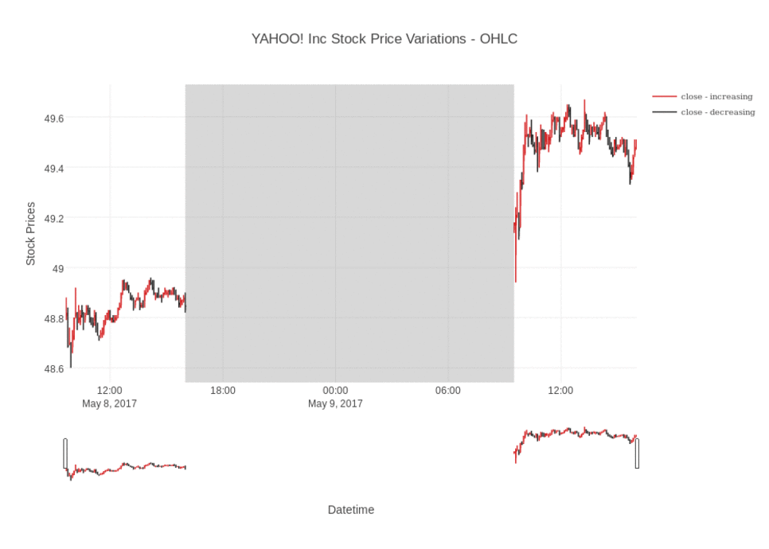

# Stock Analysis and Prediction

Welcome to my blog, where I explore the correlation between stock variations and human sentiments on Twitter using Apache Spark SQL and DataFrames. By leveraging data from Yahoo Finance, Google Finance, and fundamental metrics from Annual SEC 10K filings, I analyze stock prices over the past five years. Can we uncover some amazing patterns that depict the correlation between these stock variations and human sentiments over the past decade? Let's find out!

## Apache Spark SQL and DataFrames

Apache Spark is a powerful open-source big data processing framework that provides fast and distributed data processing capabilities. Spark SQL is a module in Apache Spark that provides a programming interface for querying structured and semi-structured data using SQL queries. DataFrames are a distributed collection of data organized into named columns, similar to a table in a relational database.

By utilizing Spark SQL and DataFrames, I can efficiently query, compare, and explore stock data from Yahoo Finance, Google Finance, and fundamental metrics from Annual SEC 10K filings. This allows for comprehensive analysis and visualization of the stock market.

## Yahoo Finance and Google Finance

Yahoo Finance and Google Finance are popular financial websites that provide a wealth of information on stocks, including historical price data, financial statements, news, and more. By leveraging these platforms, I can gather historical stock price data for various companies and perform in-depth analysis.

## Fundamental Metrics from Annual SEC 10K Filings

In addition to stock price data, I incorporate fundamental metrics from Annual SEC 10K filings. These filings contain detailed financial information about companies, such as revenue, earnings, assets, liabilities, and more. By integrating this data into the analysis, I can gain a deeper understanding of a company's financial health and its impact on stock prices.

## Correlation between Stock Variations and Human Sentiments on Twitter

One intriguing aspect of this analysis is the exploration of the correlation between stock variations and human sentiments on Twitter. Twitter is a popular social media platform where people express their opinions and share information in real-time. By analyzing tweets related to specific stocks and extracting sentiment from them, we can examine how human sentiments align with stock price movements.

To achieve this, I leverage various natural language processing techniques to analyze the sentiment of tweets. By comparing sentiment trends with stock price variations, we can identify potential correlations and patterns.

## Celebrating Big Data Tools

In addition to Apache Spark, there are numerous other big data tools available that can enhance stock analysis and prediction. Some popular tools include:

1. Hadoop: An open-source distributed processing framework that enables the storage and processing of large datasets across multiple clusters.

2. Apache Kafka: A distributed streaming platform that enables real-time data streaming and processing.

3. Apache Flink: A powerful stream processing framework that provides low-latency and high-throughput data processing capabilities.

By incorporating these tools into the analysis pipeline, we can handle massive volumes of stock data, perform real-time analysis, and make more accurate predictions.

Thank you for joining me on this stock analysis and prediction journey. To explore the analysis in more detail, please visit [Yahoo!Spark](http://kocharshaivi19.github.io/Stock-Analysis-and-Prediction/Yahoo!Spark). Feel free to reach out if you have any questions or suggestions. Happy analyzing! Lets see [Yahoo!Spark](http://kocharshaivi19.github.io/Stock-Analysis-and-Prediction/Yahoo!Spark) :)

